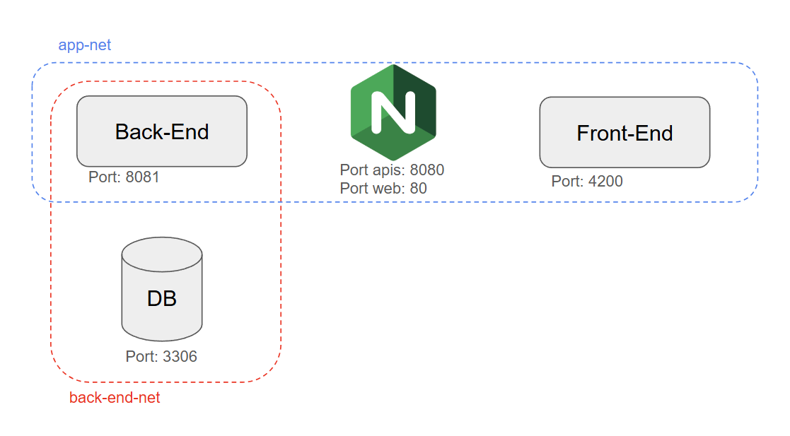

[](https://classroom.github.com/a/kGK9N93c)
[](https://classroom.github.com/online_ide?assignment_repo_id=17294528&assignment_repo_type=AssignmentRepo)
# Examen Flight Check-in

El siguiente parcial está orientado a que los alumnos puedan demostrar los conocimientos adquiridos en la materia. 
Los alumnos eligieron ser evaluados haciendo una aplicación web para el check-in de vuelos.

En el parcial deberán demostrar que pueden programar la aplicación de BE en Java, integrarlo con una base de datos MySql 
y exponer una API REST. Adicionalmente, deberán integrarla con el front-end que se les proporciona, ruteando las peticiones
usando como proxy reverso nginx.

Aquí un diagrama de como deben quedar la arquitectura:



El proyecto se entrega vacío, sin ninguna implementación. Los alumnos deberán completar el proyecto para que funcione
correctamente y cumpla con los requerimientos solicitados. Es muy importante que las APIs expuestas cumplan con los
contratos definidos.

---

## Requerimientos funcionales

### Flights

Deben implementar un endpoint que permita crear un vuelo **(flights)** y consultar un vuelo por su id. El vuelo tiene un
mapa de asientos que se debe manejar. el estado de los asientos puede ser:
 * reserved: ya fue reservado para un pasajero
 * available: está disponible para reservarlo

Cuando un vuelo se crea se debe verificar que la fecha del vuelo sea mayor a la fecha actual al menos en 6 horas.

```
GET by ID

curl --location 'http://flights:8080/flights/AR1550'
```
```
POST

curl --location 'http://flights:8080/flights' \
--header 'Content-Type: application/json' \
--data-raw '{
  "id": "AR1550",
  "aircraft": "Boeing 737-800",
  "departure": "2024-12-01T15:30:00Z",
  "airport": {
    "name": "Aeropuerto Internacional de Ciudad de México",
    "code": "MMMX",
    "location": "Ciudad de México, México"
  },
  "seat_map": [
    {
      "seat": "1A",
      "status": "reserved"
    },
    {
      "seat": "1B",
      "status": "available"
    }
  ]
}'
```
Aquí el json de ejemplo que debe manejar:

```json
{
  "id": "AR1550",
  "aircraft": "Boeing 737-800",
  "departure": "2024-12-01T15:30:00Z",
  "airport": {
    "name": "Aeropuerto Internacional de Ciudad de México",
    "code": "MMMX",
    "location": "Ciudad de México, México"
  },
  "seat_map": [
    {
      "seat": "1A",
      "status": "reserved"
    },
    {
      "seat": "1B",
      "status": "available"
    }
  ]
}
```

### Reservations

Deben implementar un endpoint que permita crear nuevas reservas para un vuelo **(reservations)**, siempre que no se hayan vendido 
ya todos los asientos. También deben poderse consultar las reservas por su id. 

Las reservas manejan los siguientes estados: 
 * READY-TO-CHECK-IN: La reserva fue creada pero no se ha hecho el check-in
 * CHECKED-IN: La reserva ya fue checkeada
 * DUE: La reserva está vencida es decir que no fue chequeada y la fecha y hora del vuelo ya pasó

```
GET by ID

curl --location 'http://flights:8080/reservations/AF456B'
```
```
POST

curl --location 'http://flights:8080/reservations' \
--header 'Content-Type: application/json' \
--data-raw '{
    "id": "AF456B",
    "status": "READY-TO-CHECK-IN",
    "flight": "AR1550",
    "passengers": [
      {
        "name": "Diego Maradona",
        "seat": ""
      },
      {
        "name": "Guillermo Coppola",
        "seat": ""
      }
    ]
  }'
```

Aquí el json de ejemplo que debe manejar:

```json
  {
    "id": "AF456B",
    "status": "READY-TO-CHECK-IN",
    "flight": "AR1550",
    "passengers": [
      {
        "name": "Diego Maradona",
        "seat": ""
      },
      {
        "name": "Guillermo Coppola",
        "seat": ""
      }
    ]
  }
```

### Check-in

Deben implementar un endpoint que permita hacer el check-in de una reserva. El check-in debe cambiar el estado
de la reserva a CHECKED-IN y guardar el asiento que se le asignó a los pasajeros. Para esto implementaremos un PUT 
sobre reservations, donde recibimos el ID de la reserva y el mismo body de reservation pero con los datos cambiados.

Solo se debe procesar la petición si la reserva está en estado READY-TO-CHECK-IN o no ha vencido, si la misma está vencida,
debe devolver un error y cambiar el estado a DUE. Adicionalmente, debe verificar que todos los asientos que se asignan a
los pasajeros estén disponible, si no lo están, debe devolver un error. Si los asientos están disponibles, debe cambiar
el estado de los asientos a reserved y el estado de la reserva a CHECKED-IN.

```
PUT

curl --location 'http://flights:8080/reservations' \
--request PUT \
--header 'Content-Type: application/json' \
--data-raw '{
    "id": "AF456B",
    "status": "CHECKED-ID",
    "flight": "AR1550",
    "passengers": [
      {
        "name": "Diego Maradona",
        "seat": "A1"
      },
      {
        "name": "Guillermo Coppola",
        "seat": "C15"
      }
    ]
  }'
```

## Requerimientos NO funcionales

- La aplicación debe ser desarrollada en Java 17.
- Debe tener al menos 80% de cobertura de test unitarios.
- Deben respetar los contratos de las APIs.
- Deben incluir mensajes de log ERROR y WARNING en la aplicación.